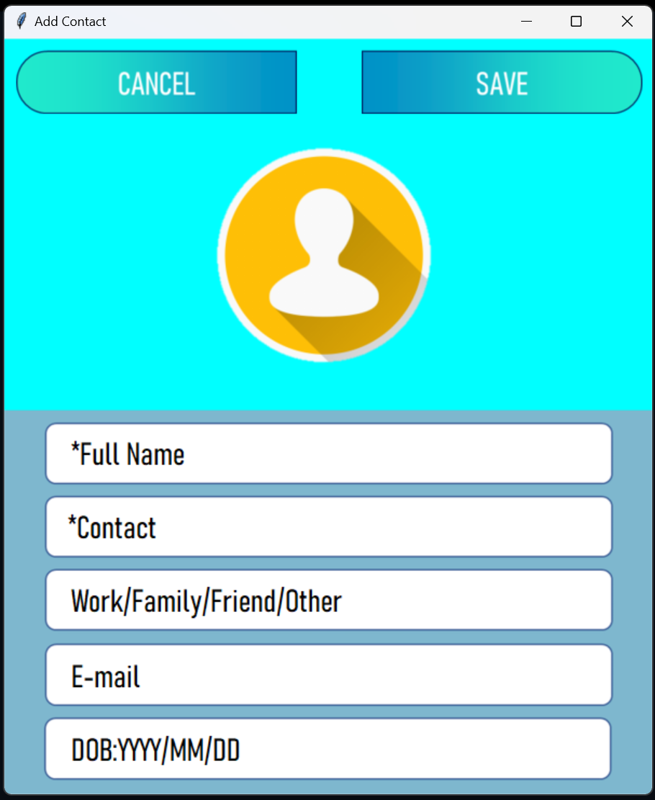

# 📘 Contact Book Application

## 🌟 Overview

Contact Book is a robust desktop application built with Python, providing a user-friendly interface for managing personal contacts. This application allows users to add, view, edit, search, and categorize contacts with features like profile pictures and comprehensive contact details.

## 🚀 Features

- **Add Contacts**: Easily add new contacts with detailed information
- **Profile Pictures**: Custom profile picture support for each contact
- **Contact Categories**: Organize contacts into categories (Work, Family, Friend, Other)
- **Search Functionality**: Quickly find contacts by name
- **Edit and Delete**: Modify or remove contact information seamlessly
- **User-Specific Data**: Separate contact lists for different users

## 🛠 Technologies Used

- **Language**: Python
- **GUI**: Tkinter
- **Database**: MySQL
- **Image Processing**: Pillow (PIL)
- **Additional Libraries**: mysql-connector, numpy

## 📦 Prerequisites

- Python 3.7+
- MySQL Server
- Required Python packages:
  - tkinter
  - mysql-connector-python
  - Pillow
  - numpy

## 🔧 Installation

1. Clone the repository
   ```bash
   git clone https://github.com/Harsh3304/ContactBook.git
   ```

2. Install required dependencies
   ```bash
   pip install -r requirements.txt
   ```

3. Set up MySQL database
   - Ensure MySQL server is running
   - Create a database named `ContactBook`
   - Configure database credentials in the script
   - The code also has the feature to create the Database by itself, so simply just execute the code 

## 🖥 How to Run

1. Navigate to the project directory
2. Run the main script
   ```bash
   python contact_book.py
   ```

## 🌈 User Interface

The application provides an intuitive, modern interface with:
- Main screen with options to Add, See, and Search Contacts
- Contact management with category filtering
- Responsive design with scrollable contact lists

## 📸 Screenshots

1. **SignIn/ SignUp page**  
     


2. **Add Contact Page**  
     
   SignIn page

3. **Home page (For new User)**
    

4. **Search Contact page (For new User)**
    

## 🤝 Contributing

1. Fork the repository
2. Create your feature branch (`git checkout -b feature/AmazingFeature`)
3. Commit your changes (`git commit -m 'Add some AmazingFeature'`)
4. Push to the branch (`git push origin feature/AmazingFeature`)
5. Open a Pull Request


## 📧 Contact

Harsh Patel - harshp3304@gmail.com

Project Link: [https://github.com/Harsh3304/ContactBook.git](https://github.com/Harsh3304/ContactBook.gitk)